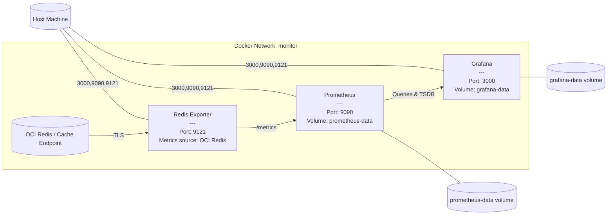

# Redis Metrics Monitoring Stack (OCI Cache + Redis Exporter + Prometheus + Grafana)

## Overview

This setup connects to an **OCI-hosted Redis/Cache endpoint** and provides end-to-end observability through **Prometheus** and **Grafana**.

The purpose of the stack is to:

1. Expose metrics from your OCI Redis endpoint using **Redis Exporter**.
2. Collect and store those metrics in **Prometheus**.
3. Visualise them through **Grafana dashboards**.

The local stack does **not** host Redis itself; it connects securely to your OCI-provided Redis endpoint.

---

## Components

### 1. Redis Exporter

* Collects metrics from your **OCI Redis (Cache)** instance.
* Configured using environment variables (such as `REDIS_ADDR`, `REDIS_USER`, `REDIS_PASSWORD`).
* Exposes metrics on port **9121**, which are scraped by Prometheus.
* TLS verification may be disabled (`REDIS_EXPORTER_SKIP_TLS_VERIFICATION=true`) if the endpoint uses OCI’s internal certificate chain.

Refer to the configuration section in **`docker-compose.yaml`** for details.

---

### 2. Prometheus

* Centralised metrics collection and time-series storage.
* Periodically scrapes the Redis Exporter endpoint (`redis-exporter:9121`).
* Persists historical data in the `prometheus-data` named volume.
* Configuration and scrape targets are defined in the mounted `prometheus.yml` file.

Prometheus UI: [http://localhost:9090](http://localhost:9090)

---

### 3. Grafana

* Provides a visual interface to explore Redis metrics.
* Pre-provisioned with Prometheus as a data source.
* Dashboards can be created or imported to track latency, hits/misses, memory, and system metrics.
* Stores data in the `grafana-data` volume for persistence.

Grafana UI: [http://localhost:3000](http://localhost:3000)
Default credentials and security settings are defined in **`docker-compose.yaml`**.

---

## Network

All services share a custom Docker bridge network named **`monitor`**, allowing internal hostname-based communication (`prometheus`, `grafana`, `redis-exporter`).

---

## Volumes

* `prometheus-data` → persists Prometheus TSDB data.
* `grafana-data` → stores dashboards, data sources, and configurations.

---

## Usage

1. Clone the repository.
2. Review and update **`docker-compose.yaml`**:

   * Ensure your OCI Redis endpoint and credentials are correctly set under `REDIS_ADDR`, `REDIS_USER`, and `REDIS_PASSWORD`.
   * Confirm Prometheus scrape targets in `prometheus/prometheus.yml`.
3. Start the stack:

   ```bash
   docker compose up -d
   ```
4. Access:

   * Prometheus: [http://localhost:9090](http://localhost:9090)
   * Grafana: [http://localhost:3000](http://localhost:3000)
   * Redis Exporter metrics: [http://localhost:9121/metrics](http://localhost:9121/metrics)

---

## Architecture Diagram



---

## Security & Best Practices

1. **Never commit credentials** — use Docker secrets or `.env` files ignored by Git.
2. **Rotate admin passwords** in Grafana before deployment.
3. **Restrict exposed ports** if deploying on a public host.
4. **Enable TLS** for production environments.

---

## Reference

https://github.com/oliver006/redis_exporter

All configuration details are in [`docker-compose.yaml`](./docker-compose.yaml).
Check the file for exact container parameters, volume mounts, and environment variables.
